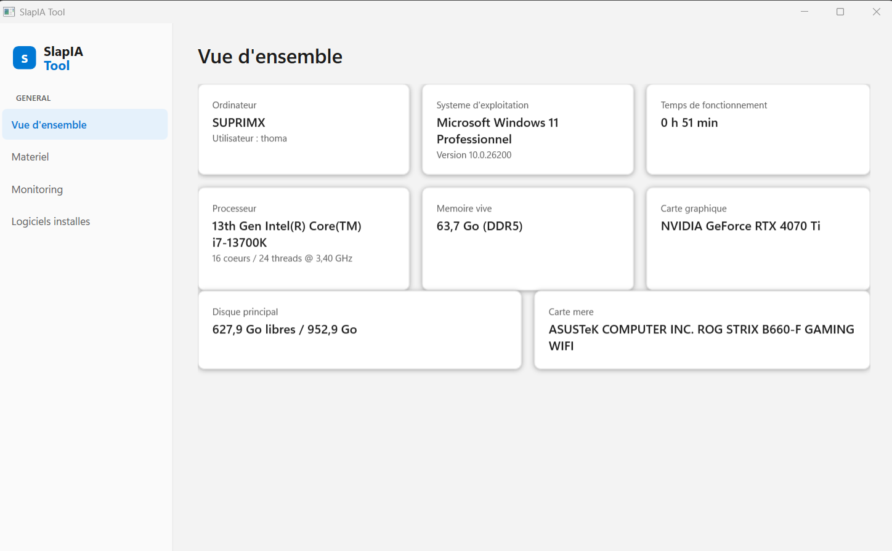

<div align="center">

# SlapIA Tool

**Informations systeme et monitoring temps reel pour Windows.**

Une application de bureau native, au design Fluent (Windows 11), qui affiche le materiel,
le systeme, les performances en direct et les logiciels installes sur un PC.



</div>

## Fonctionnalites

- **Vue d'ensemble** — carte de synthese : ordinateur, OS, uptime, CPU, RAM, GPU, disque, carte mere.
- **Materiel** — detail complet : processeur, memoire, cartes graphiques, disques physiques, volumes, cartes reseau, BIOS.
- **Monitoring temps reel** — utilisation CPU / RAM / disque / GPU avec graphique en direct (rafraichi chaque seconde).
- **Logiciels installes** — inventaire des applications installees (nom, version, editeur, date d'installation) avec recherche instantanee.

## Stack technique

| | |
|---|---|
| Framework | .NET 8 / WPF |
| Architecture | MVVM ([CommunityToolkit.Mvvm](https://github.com/CommunityToolkit/dotnet)) |
| Design | Fluent 2 (palette Windows 11), [WPF-UI](https://github.com/lepoco/wpfui) |
| Graphiques | [LiveCharts2](https://livecharts.dev/) |
| Donnees systeme | WMI (`System.Management`), compteurs de performance Windows, registre |
| Packaging | MSIX (Microsoft Store / winget) |

## Demarrer en developpement

Prerequis : [SDK .NET 8](https://dotnet.microsoft.com/download/dotnet/8.0), Windows 10/11.

```powershell
git clone https://github.com/<votre-compte>/slapia-tool.git
cd slapia-tool
dotnet run --project src/SlapIA.App
```

## Compiler un paquet installable (MSIX)

Le script `packaging/build-msix.ps1` publie l'application, l'empaquette en `.msix`
et peut la signer avec un certificat de test pour l'installer localement :

```powershell
# Empaqueter uniquement
./packaging/build-msix.ps1

# Empaqueter + signer avec un certificat auto-signe (pour tester l'installation en local)
./packaging/build-msix.ps1 -Sign
```

Le paquet est genere dans `packaging/out/SlapIA.Tool.msix`. Pour l'installer en local
apres signature, importez une fois le certificat genere puis double-cliquez sur le `.msix` :

```powershell
Import-Certificate -FilePath "packaging/out/SlapIA-dev-cert.pfx" -CertStoreLocation Cert:\LocalMachine\Root
```

### Publication sur le Microsoft Store (et winget)

1. Reserver le nom de l'application sur le [Centre partenaires Microsoft](https://partner.microsoft.com/dashboard).
2. Mettre a jour `Identity` / `Publisher` dans `packaging/Package.appxmanifest` avec les valeurs fournies par le Centre partenaires.
3. Generer le `.msix` (`./packaging/build-msix.ps1`, sans `-Sign` — le Store signe lui-meme le paquet).
4. Soumettre le paquet via le Centre partenaires.
5. Une fois publiee, l'application est automatiquement disponible via `winget install` (source `msstore`) — aucune etape supplementaire n'est necessaire.

Pour une distribution egalement via le depot communautaire `winget-pkgs` (source `winget` par defaut),
publier le `.msix` sur une release GitHub puis soumettre un manifeste avec [`wingetcreate`](https://github.com/microsoft/winget-create).

## Structure du projet

```
SlapIA tool/
├─ src/SlapIA.App/
│  ├─ Models/        # Enregistrements de donnees (SystemSnapshot, InstalledApplication, ...)
│  ├─ Services/       # Acces WMI, compteurs de perf, registre
│  ├─ ViewModels/      # Logique MVVM (CommunityToolkit.Mvvm)
│  ├─ Views/          # Pages XAML (Overview, Hardware, Monitoring, Software)
│  └─ Converters/       # Convertisseurs de binding XAML
├─ packaging/          # Manifeste MSIX, assets, script d'empaquetage
└─ docs/              # Captures d'ecran
```

## Confidentialite

SlapIA Tool fonctionne entierement en local : aucune information systeme n'est envoyee
vers un serveur externe.

## Licence

MIT
